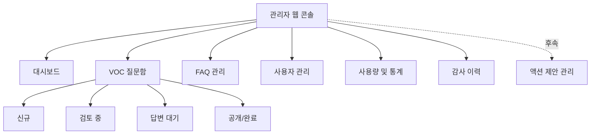
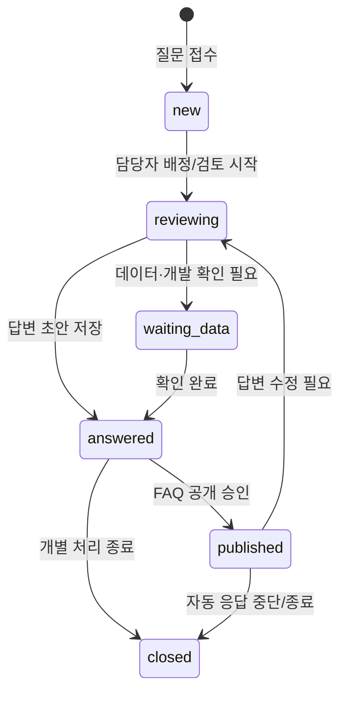
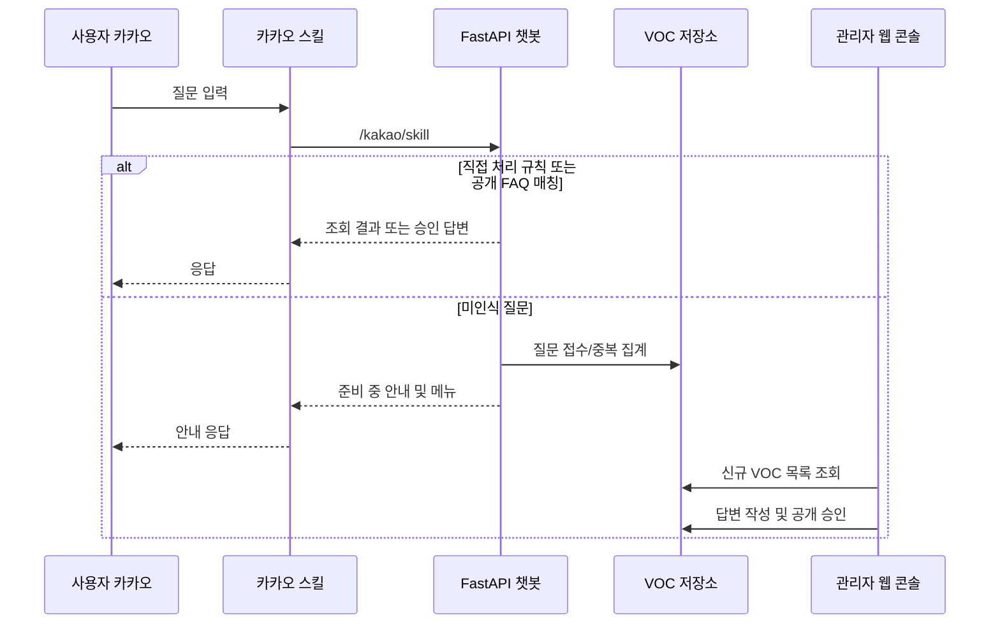
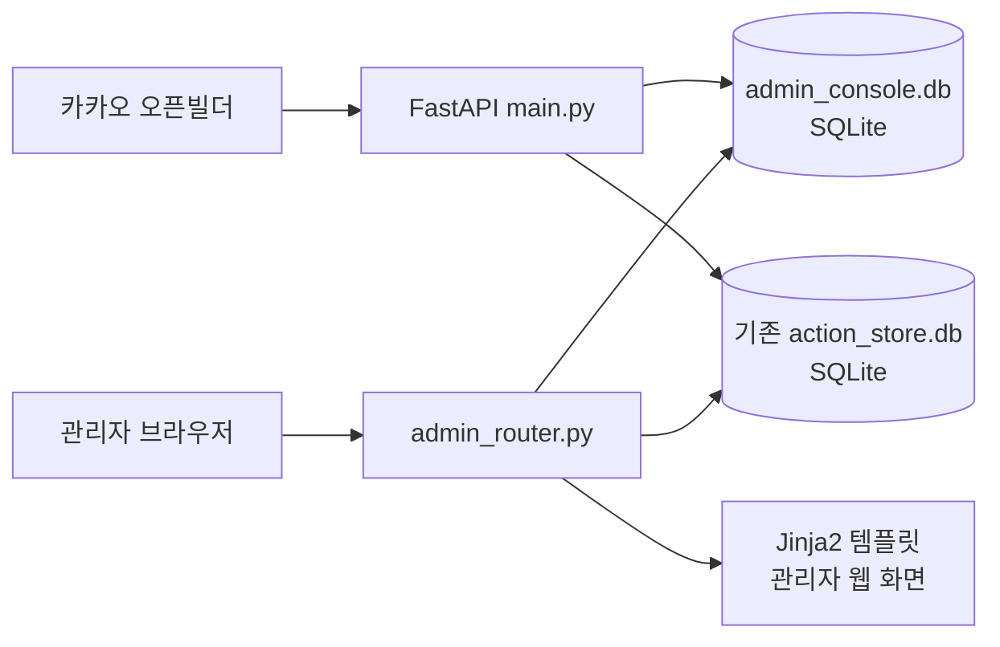

# 챗봇 관리자 웹 콘솔 기획안

> 작성일: 2026-07-15  
> 범위: **1차는 관리자 기능 웹화면 구축**. 사용자용 웹 채널, Dify 재연결, 액션 제안 운영 화면은 후속 단계로 설계만 반영한다.

---

## 1. 추진 배경

현재 챗봇은 카카오 대화와 FastAPI 서버에서 운영되며, 관리자 기능도 카카오 명령어 방식으로 일부 제공한다. 다만 다음 업무는 대화형 화면만으로 처리하기 어렵다.

- 직접 인식하지 못한 질문(VOC)을 누적·분류·답변·공개하는 업무
- 자주 발생하는 미지원 질문의 빈도와 처리 현황 확인
- 등록 사용자, 관리자 권한, 사용량을 목록·검색·필터 방식으로 관리하는 업무
- 이후 세일즈 액션 제안의 처리 현황과 담당자 응답을 한 화면에서 관리하는 업무

따라서 기존 FastAPI 서버에 내부 관리자 웹 콘솔을 추가한다. 카카오 챗봇은 사용자 접점으로 유지하고, 웹 콘솔은 운영 담당자의 관리 접점으로 분리한다.

---

## 2. 목표 및 원칙

### 2.1 1차 목표

1. 관리자만 접속 가능한 웹 관리 화면을 만든다.
2. Dify로 전달하지 않는 미지원 질문을 VOC로 저장·조회·처리한다.
3. 관리자가 작성·승인한 FAQ 답변을 이후 동일 질문에 재사용할 수 있게 한다.
4. 사용자·권한·사용량 현황을 웹에서 확인한다.
5. 향후 세일즈 액션 제안 관리 기능을 같은 콘솔에 자연스럽게 추가할 수 있는 구조를 만든다.

### 2.2 설계 원칙

| 원칙 | 내용 |
|---|---|
| 운영 안정성 우선 | 기존 카카오 질문/조회 기능의 동작을 바꾸지 않고, 관리자 기능을 별도 라우터·저장소로 분리한다. |
| Dify 기본 차단 | 직접 처리되지 않은 질문은 기본적으로 Dify로 전송하지 않고 VOC로 저장한다. |
| 승인 후 자동화 | 관리자가 `공개`한 답변만 이후 사용자에게 자동 응답한다. 초안·검토 중 답변은 노출하지 않는다. |
| 원문 보존 | 사용자 원문 질문과 정규화 질문을 함께 보관하여 이력·분석·중복 처리가 가능해야 한다. |
| 최소 권한 | 웹 콘솔은 관리자 권한을 가진 사용자만 접근하며, 사용자용 카카오 식별자만으로 웹 인증하지 않는다. |
| 확장 가능성 | VOC와 액션 제안은 공통 상태·담당자·이력 구조를 사용하되, 도메인 데이터는 분리한다. |

---

## 3. 범위 정의

### 3.1 1차 개발 범위: 관리자 웹 콘솔

| 메뉴 | 1차 제공 기능 |
|---|---|
| 대시보드 | VOC 신규/처리 대기/공개 FAQ 수, 최근 7일 유입, 사용자 수, 액션 제안 현황 요약(읽기 전용) |
| VOC 질문함 | 미지원 질문 목록, 검색, 필터, 중복 집계, 상세 조회 |
| VOC 처리 | 분류, 담당자 지정, 상태 변경, 관리자 답변 작성, 공개 여부 설정 |
| FAQ 관리 | 공개된 답변 조회·수정·비공개 전환, 동일 질문 매칭 키워드 관리 |
| 사용자 관리 | 등록 사용자 조회, 관리자 권한 부여/회수, 화이트리스트·블랙리스트 관리 |
| 사용량 | 카카오 요청 수, 직접 처리 수, VOC 접수 수, 과거 Dify 호출 수 확인 |
| 감사 이력 | VOC·FAQ·권한 변경의 작업자/시각/변경 전후 내용 확인 |

### 3.2 후속 범위: 액션 제안 관리

기존 세일즈 액션 제안은 이미 SQLite 저장소와 사용자용 리포트 화면을 보유한다. 1차에는 대시보드 요약과 기존 제안 목록의 조회만 고려하고, 아래 기능은 후속 개발한다.

- 액션 제안 전체 목록·상태·우선순위·팀·브랜드 필터
- 제안 담당자 배정 및 관리자 코멘트
- 사용자 응답(실행/보류/해당없음) 모니터링
- 미열람/미응답 리마인드 관리
- 액션 제안 성과·완료율 대시보드

### 3.3 1차 제외 범위

- 일반 사용자가 웹에서 질문하거나 답변을 조회하는 기능
- VOC 답변을 카카오 사용자에게 사후 푸시하는 기능
- Dify를 이용한 자동 답변 생성 또는 자동 분류
- 사내 SSO 연동 전의 외부 공개 운영
- Databricks를 원본 운영 DB로 사용하는 구조

---

## 4. 사용자 및 권한

| 역할 | 접근 권한 | 주요 업무 |
|---|---|---|
| 시스템 관리자 | 전체 | 계정/권한, 모든 VOC·FAQ·통계·감사 이력 관리 |
| VOC 운영자 | VOC/FAQ | 질문 분류, 답변 초안·검토·공개, 통계 조회 |
| 액션 운영자 | 액션 제안 | 후속 단계에서 액션 제안 조회·배정·상태 관리 |
| 조회 전용 관리자 | 조회 | 대시보드 및 목록 조회, 수정 불가 |

초기에는 기존 등록 사용자 데이터의 `role == "admin"`을 관리자 후보로 활용한다. 단, 웹 접속 인증은 카카오 `user_id`를 직접 신뢰하지 않고 별도 관리자 계정과 세션을 사용한다.

---

## 5. 정보 구조 및 화면 구성

### 5.1 전체 메뉴 구조



### 5.2 공통 화면 구성

- **상단 헤더**: 서비스명, 접속 관리자, 알림 배지, 로그아웃
- **좌측 메뉴**: 대시보드, VOC 질문함, FAQ, 사용자, 통계, 감사 이력
- **본문**: 목록/상세 2단 또는 목록→상세 이동 방식
- **공통 검색/필터**: 기간, 상태, 분류, 팀, 담당자, 키워드
- **작업 보호**: 저장하지 않은 변경사항 이탈 경고, 공개/권한 변경의 확인 모달
- **반응형**: 데스크톱 우선, 태블릿 최소 지원. 모바일 운영은 1차 우선순위가 낮다.

---

## 6. 핵심 화면 상세

### 6.1 대시보드

**목적**: 관리자가 접속 즉시 운영 상태와 우선 처리 항목을 확인한다.

| 영역 | 표시 내용 |
|---|---|
| 핵심 지표 | 신규 VOC, 답변 대기 VOC, 공개 FAQ, 최근 7일 접수 수 |
| 처리 현황 | 상태별 건수 및 평균 최초 처리 시간 |
| 반복 질문 | 최근 30일 질문 빈도 Top 10 |
| 분류별 현황 | 매출/수익성/미출고/오류/기능요청/기타 비중 |
| 사용자 현황 | 등록 사용자 수, 관리자 수, 최근 이용자 수 |
| 액션 제안 요약 | 전체/미열람/응답대기/완료 수 — 1차는 읽기 전용 |
| 빠른 작업 | `신규 VOC 보기`, `답변 대기 보기`, `FAQ 등록` |

### 6.2 VOC 질문함 목록

**목적**: 미지원·오류·개선 요청 질문을 우선순위에 따라 처리한다.

목록 컬럼:

| 컬럼 | 설명 |
|---|---|
| 상태 | 신규, 검토 중, 답변 대기, 답변 완료, 공개, 종료 |
| 질문 | 대표 질문 원문 (말줄임 처리) |
| 분류 | 매출, 수익성, 미출고, 오류, 기능 요청, 정책/안내, 기타 |
| 발생 수 | 동일 정규화 질문 또는 병합된 질문의 누적 수 |
| 소속/사용자 | 최근 질문자의 팀과 이름 |
| 최근 발생 | 마지막 접수 시각 |
| 담당자 | 처리 담당 운영자 |
| 처리 기한 | 선택 입력 |

필터:

- 상태, 분류, 담당자, 팀, 기간
- `반복 3회 이상`, `답변 미작성`, `공개 가능`, `오류 신고`
- 제목/질문 본문/답변 전체 키워드 검색

정렬 기본값은 `신규 → 발생 수 높은 순 → 최근 발생 순`으로 한다.

### 6.3 VOC 상세 및 처리 화면

**목적**: 한 질문을 검토하고 재사용 가능한 답변 또는 개발 과제로 전환한다.

화면 영역:

1. **질문 요약**
   - 대표 질문, 최초/최근 접수 시각, 누적 발생 수, 상태, 분류, 중요도
2. **질문 이력**
   - 동일 그룹의 원문 질문 목록, 발생 시각, 사용자명, 소속 팀
   - 개인정보 최소 노출 원칙에 따라 목록에서는 이름 마스킹 옵션 제공
3. **처리 정보**
   - 담당자, 상태, 처리 기한, 내부 메모, 관련 기능/장애 링크
4. **답변 작성**
   - 사용자 노출 답변
   - 내부 운영 메모
   - 답변 유형: `FAQ`, `정책 안내`, `기능 개발 필요`, `오류 수정 필요`, `데이터 확인 필요`
5. **공개 설정**
   - 저장만 하기
   - 관리자 검토 요청
   - FAQ로 공개
   - 자동 응답 비활성화
6. **질문 매칭 설정**
   - 정확 일치 질문 키
   - 허용 표현(동의어/대표 문구)
   - 매칭 테스트 입력 및 예상 결과

상태 전이:



### 6.4 FAQ 관리

**목적**: 승인된 답변을 사용자 챗봇의 안전한 자동 응답 지식으로 관리한다.

FAQ 목록 항목:

- 제목/대표 질문
- 자동 응답 상태: 공개/비공개
- 매칭 방식: 정확 일치, 정규화 일치, 관리자 지정 표현
- 답변 유형 및 분류
- 최초 공개일, 최종 수정일, 수정자
- 자동 응답 횟수, 최근 응답 시각

FAQ 공개 조건:

1. 사용자 노출 답변이 작성되어 있을 것
2. 최소 1명의 운영자 또는 시스템 관리자가 공개 승인할 것
3. 개인정보, 내부 계정 정보, 원본 SQL, 토큰 등 민감정보가 없을 것
4. 질문 범위가 명확하여 오답 응답 위험이 낮을 것

초기 매칭은 다음 순서로 제한한다.

1. 공백·대소문자·일부 문장부호를 정리한 **정확 일치**
2. 관리자가 등록한 **허용 표현 정확 일치**
3. 일치하지 않으면 자동 답변하지 않고 새 VOC로 접수

의미 기반 유사도 검색은 오답 관리 체계와 평가 데이터가 축적된 후 별도 검토한다.

### 6.5 사용자 및 권한 관리

현재 JSON 기반 등록 사용자, 화이트리스트, 블랙리스트 정보를 운영 화면에서 조회·관리한다.

| 기능 | 1차 처리 방식 |
|---|---|
| 등록 사용자 조회 | 이름, 사번, 팀, 역할, 등록일, 최근 이용일 표시 |
| 역할 변경 | `user`, `admin` 변경. 시스템 관리자만 실행 가능 |
| 화이트리스트 | 추가/조회/삭제 |
| 블랙리스트 | 추가/조회/해제(사유 기록 필수) |
| 개인정보 보호 | 목록 사번 마스킹 기본값, 상세 권한 제한, 변경 이력 저장 |

### 6.6 사용량·VOC 통계

| 지표 | 정의 |
|---|---|
| 전체 질문 수 | 인증된 사용자의 전체 요청 수 |
| 직접 처리율 | 직접 조회 또는 메뉴/안내로 처리된 질문 비율 |
| VOC 전환율 | 미지원 질문으로 접수된 비율 |
| FAQ 해결률 | 공개 FAQ가 자동 응답한 질문 비율 |
| 반복 VOC | 동일 질문 그룹의 발생 수 |
| 처리 리드타임 | 접수부터 최초 답변/공개까지 걸린 시간 |
| 분류별 추이 | 매출, 수익성, 미출고, 오류, 기능요청 등 기간별 건수 |

CSV 다운로드는 1차에 포함하되, Excel 서식 출력과 Power BI 대시보드는 후속으로 둔다.

---

## 7. 챗봇과 VOC의 처리 흐름



### 7.1 사용자 안내 문구 초안

> 현재 질문하신 내용에 대한 답변은 아직 준비 중입니다.  
> 저는 매출, 수익성(CM), 미출고 현황 등을 조회해드릴 수 있어요.  
> 문의하신 내용은 관리자에게 전달되었으며, 빠른 시일 내 답변할 수 있도록 개선하겠습니다.

안내 아래에는 `메뉴`, `매출 실적`, `수익성 분석`, `미출고 현황` 빠른 버튼을 제공한다.

### 7.2 VOC 접수 제외 대상

다음은 VOC로 저장하지 않고 기존 즉시 응답 또는 오류 처리한다.

- 인사, 감사, 단순 확인 등 잡담
- 등록 전 사용자 안내와 인증 실패
- 관리자 명령어 형식 오류
- 서버/네트워크 일시 오류
- 이미 직접 처리한 조회 결과 없음 질문

단, 직접 처리 기능이 반복적으로 오류를 내는 경우에는 별도 `시스템 오류` 이벤트로 기록하여 운영자가 확인할 수 있게 한다.

---

## 8. 데이터 모델 제안

### 8.1 운영 저장소 분리

초기에는 기존 `action_store.db`와 분리된 SQLite 파일 `admin_console.db`를 사용한다.

- 위치: `E:\data\chatbot\admin_console.db`
- 이유: 기존 액션 제안 데이터와 VOC/권한/감사 데이터를 논리적으로 분리하고, 향후 Azure SQL 또는 PostgreSQL 전환을 쉽게 한다.
- 운영 규칙: 소스 저장소에 DB 파일을 커밋하지 않으며, 일 단위 백업과 접근 권한을 적용한다.

`action_proposals`는 당장은 기존 [api/action_db.py](../api/action_db.py)의 저장소를 읽기 전용 연동한다. 후속 단계에서 공통 관리자 콘솔 DB 또는 관리형 DB로 통합 이전 여부를 결정한다.

### 8.2 주요 테이블

| 테이블 | 용도 |
|---|---|
| `voc_cases` | 대표 VOC 티켓, 상태·분류·담당자·답변·공개 정보 |
| `voc_occurrences` | 개별 질문 원문과 발생 이력 |
| `faq_entries` | 공개 가능한 자동 응답 FAQ |
| `faq_patterns` | FAQ별 정확 일치/허용 표현 매칭 키 |
| `admin_accounts` | 웹 콘솔 관리자 계정과 역할 |
| `audit_logs` | 생성·수정·공개·권한 변경 이력 |
| `system_events` | 서버 오류·Dify 차단·자동 응답 실패 등 운영 이벤트 |

### 8.3 `voc_cases` 핵심 필드

| 필드 | 설명 |
|---|---|
| `case_id` | UUID 또는 표시용 일련번호 |
| `normalized_question` | 중복 집계 기준의 정규화 질문 |
| `representative_question` | 운영자가 확인하는 대표 질문 |
| `category` | 매출/수익성/미출고/오류/기능요청/정책/기타 |
| `status` | `new`, `reviewing`, `waiting_data`, `answered`, `published`, `closed` |
| `priority` | low/normal/high/urgent |
| `occurrence_count` | 질문 발생 누계 |
| `owner_admin_id` | 담당 관리자 |
| `public_answer` | 사용자 노출 답변 |
| `internal_note` | 운영자 내부 메모 |
| `faq_id` | 공개 FAQ 연결값 |
| `first_received_at`, `last_received_at` | 최초/최종 발생 시각 |
| `created_at`, `updated_at` | 레코드 생성/수정 시각 |

### 8.4 `voc_occurrences` 핵심 필드

| 필드 | 설명 |
|---|---|
| `occurrence_id` | 개별 이력 식별자 |
| `case_id` | 대표 VOC 연결값 |
| `user_id` | 카카오 사용자 식별자. 화면 노출은 최소화 |
| `user_name`, `team` | 접수 당시 사용자 정보 |
| `original_question` | 질문 원문 |
| `received_at` | 접수 시각 |
| `channel` | 초기값 `kakao` |
| `request_context` | 선택 저장. 직전 메뉴/조직 문맥 등 비민감 운영 정보 |

### 8.5 감사 이력

다음 작업은 반드시 `audit_logs`에 남긴다.

- VOC 생성, 병합, 담당자 변경, 상태 변경
- 답변 생성·수정·삭제·공개·비공개
- FAQ 매칭 표현 추가·삭제
- 사용자 역할 및 화이트/블랙리스트 변경
- 데이터 CSV 내보내기

---

## 9. 기술 아키텍처 제안

### 9.1 1차 권장 구성



| 계층 | 권장 기술 | 근거 |
|---|---|---|
| 서버 | 기존 FastAPI | 현재 서버·라우터 구조를 재사용 |
| 화면 | Jinja2 + HTML/CSS + 최소 JavaScript | 별도 프론트엔드 빌드/배포 없이 빠르게 운영 가능 |
| API | FastAPI JSON API | 목록 필터·상세 저장·통계 비동기 호출에 사용 |
| DB | SQLite + WAL | 단일 서버·소수 운영자 조건에서 빠르고 충분 |
| 인증 | 초기 로그인 세션 + 비밀번호 해시 | 카카오 식별자와 웹 관리자 인증 분리 |
| 템플릿 | 기존 Jinja2 방식 재사용 | 액션 리포트 화면에 이미 적용되어 있음 |

권장 신규 파일 구조:

```text
api/
  admin_router.py          # 관리자 웹 라우터 및 화면 엔드포인트
  admin_db.py              # VOC/FAQ/관리자/감사 저장소
  admin_auth.py            # 로그인, 세션, 역할 확인
  templates/
	admin_base.html
	admin_login.html
	admin_dashboard.html
	admin_voc_list.html
	admin_voc_detail.html
	admin_faq_list.html
	admin_users.html
	admin_usage.html
  static/
	admin.css
	admin.js
```

### 9.2 URL 및 API 초안

| 구분 | 경로 | 기능 |
|---|---|---|
| 화면 | `GET /admin/login` | 관리자 로그인 |
| 화면 | `GET /admin` | 대시보드 |
| 화면 | `GET /admin/voc` | VOC 목록 |
| 화면 | `GET /admin/voc/{case_id}` | VOC 상세·답변 편집 |
| 화면 | `GET /admin/faq` | FAQ 목록 |
| 화면 | `GET /admin/users` | 사용자·권한 관리 |
| 화면 | `GET /admin/usage` | 사용량 및 통계 |
| API | `GET /admin/api/voc` | VOC 목록 조회·필터 |
| API | `PATCH /admin/api/voc/{case_id}` | 상태/분류/담당자/답변 수정 |
| API | `POST /admin/api/voc/{case_id}/publish` | FAQ 공개 |
| API | `POST /admin/api/voc/{case_id}/merge` | 중복 VOC 병합 |
| API | `GET /admin/api/faq` | FAQ 조회 |
| API | `PATCH /admin/api/faq/{faq_id}` | FAQ 수정/비공개 |
| API | `GET /admin/api/stats` | 대시보드 통계 |

사용자 챗봇의 VOC 수집은 내부 함수로 처리한다. 외부에서 임의 VOC를 등록할 수 있는 공개 API는 1차에 만들지 않는다.

---

## 10. 인증·보안·개인정보 기준

현재 서버는 ngrok 기반 외부 URL을 사용하므로, 관리자 콘솔을 무인증으로 외부 노출하면 안 된다.

### 10.1 1차 필수 보안

1. `/admin` 전체에 로그인 세션과 역할 검증을 적용한다.
2. 비밀번호는 평문 저장 금지. `bcrypt` 또는 `argon2` 해시를 사용한다.
3. 세션 쿠키는 `HttpOnly`, `Secure`, `SameSite=Lax` 이상으로 설정한다.
4. CSRF 토큰을 수정·삭제·공개 요청에 적용한다.
5. 로그인 실패 횟수 제한과 관리자 작업 감사 로그를 적용한다.
6. 관리자 API와 화면의 접근 권한을 서버 측에서 모두 검증한다.
7. 개발·운영 환경의 관리자 초기 비밀번호는 환경변수 또는 안전한 비밀 저장소로만 주입한다.
8. SQLite DB와 백업 파일은 서버 서비스 계정 및 지정 관리자만 읽을 수 있도록 NTFS 권한을 제한한다.

### 10.2 개인정보 최소화

- 목록에서는 사용자 이름과 사번을 기본 마스킹한다.
- VOC 화면에는 업무 처리에 필요한 이름·팀만 표시하고, 카카오 `user_id`는 시스템 관리자만 볼 수 있게 한다.
- 질문 원문에 개인·거래처 정보가 포함될 수 있으므로 CSV 다운로드도 감사 로그에 남긴다.
- 보관 기한은 운영 정책으로 정한다. 권장값은 개별 발생 이력 1년, 집계/FAQ 이력 3년이다.

### 10.3 운영 환경 전환 기준

ngrok 무료 터널은 PoC·내부 검증 용도에 한정한다. 정식 운영 전에는 사내 Reverse Proxy/VPN 또는 Azure App Service 같은 통제 가능한 배포 경로와 HTTPS 인증서를 사용한다.

---

## 11. 액션 제안 기능 확장 설계

기존 액션 제안 저장소에는 `action_proposals`, `action_logs`, `action_daily_sent`가 있으며, 사용자용 상세 리포트와 목록 API도 이미 존재한다. 관련 구현은 [api/action_db.py](../api/action_db.py) 및 [api/action_router.py](../api/action_router.py)에 있다.

관리자 콘솔은 아래 공통 모델을 기반으로 VOC와 액션 제안을 함께 다룬다.

| 공통 요소 | VOC | 액션 제안 |
|---|---|---|
| 업무 항목 | 사용자가 해결하지 못한 질문 | 시스템이 감지한 영업 시그널 |
| 상태 | 신규→검토→답변/공개→종료 | 발송→열람→응답→완료 |
| 담당자 | VOC 운영자 | 영업 담당자/관리자 |
| 중요도 | 질문 빈도·업무 영향 | 시그널 우선순위 |
| 이력 | 질문 발생·답변 변경 | 열람·승인·보류·기한 변경 |
| 통계 | VOC 전환율·FAQ 해결률 | 열람률·응답률·완료율 |

후속 화면 메뉴는 `액션 제안` 아래에 다음을 둔다.

- 전체 제안
- 응답 대기
- 보류/기한 초과
- 완료 제안
- 시그널별 효과 분석

VOC 답변에서 “기능 개발 필요”를 선택할 때 액션 제안이나 별도 개발 백로그와 연결할 수 있도록 `related_type`, `related_id` 확장 필드를 설계한다.

---

## 12. 개발 단계 및 산출물

### Phase 0. 상세 설계

- 관리자 역할 및 초기 운영자 확정
- VOC 분류 체계·상태·우선순위 확정
- 사용자 안내 문구와 FAQ 공개 승인 기준 확정
- DB DDL, API 명세, 화면 와이어프레임 확정
- 보안·백업·보관 정책 확인

### Phase 1. 관리자 콘솔 기반

- `admin_db.py`: SQLite 스키마, VOC/FAQ/감사 CRUD
- `admin_auth.py`: 관리자 로그인·세션·권한
- `admin_router.py`: 대시보드·VOC 목록/상세·FAQ·사용자 조회
- 공통 레이아웃 및 반응형 관리자 화면
- 관리자 작업 감사 이력
- SQLite 일 단위 백업 작업 정의

**완료 기준**: 관리자가 로그인하여 신규 VOC를 보고, 답변을 저장·공개·비공개 처리하며, 모든 작업 이력을 확인할 수 있다.

### Phase 2. 챗봇 VOC 연동

- 직접 처리·공개 FAQ 매칭 후 미인식 질문만 VOC로 저장
- Dify 기본 호출 비활성화
- 중복 질문 정규화·발생 횟수 집계
- 고정 안내 메시지·빠른 메뉴 제공
- 공개 FAQ의 정확 일치 자동 응답

**완료 기준**: 미지원 질문이 Dify로 전달되지 않고 VOC로 저장되며, 승인된 FAQ는 동일 질문에 자동 응답한다.

### Phase 3. 운영 통계 및 액션 제안 읽기 연동

- VOC/FAQ/사용량 통계와 CSV 다운로드
- 기존 `action_store.db`의 요약 카드·목록 조회
- 시스템 오류 이벤트 기록

### Phase 4. 액션 제안 관리 및 운영 고도화

- 액션 제안 배정·리마인드·관리자 코멘트·통합 대시보드
- Azure SQL 또는 PostgreSQL 전환 검토
- Databricks VOC 분석 테이블 적재 및 Power BI 연동
- 사내 SSO·배포 인프라 전환

---

## 13. 검증 시나리오

| 구분 | 시나리오 | 기대 결과 |
|---|---|---|
| 인증 | 일반 사용자가 `/admin` 접근 | 로그인 또는 권한 없음 화면 |
| 인증 | VOC 운영자 로그인 | VOC/FAQ 접근 가능, 권한 관리 불가 |
| VOC 접수 | 직접 처리 불가 질문 입력 | VOC 생성 또는 기존 건 발생 수 증가 |
| 중복 | 공백·대소문자만 다른 동일 질문 | 동일 VOC에 발생 이력 추가 |
| FAQ | 공개 FAQ와 정확 일치 질문 입력 | Dify 호출 없이 FAQ 답변 반환 |
| FAQ | 비공개 FAQ와 일치 질문 입력 | 자동 답변하지 않고 VOC 처리 |
| 답변 | 운영자가 답변 초안 저장 | 사용자에게 자동 노출되지 않음 |
| 공개 | 시스템 관리자가 FAQ 공개 | 이후 매칭 질문에 자동 응답 |
| 감사 | 답변/권한 변경 | 변경자·시각·변경 내용 기록 |
| 액션 연동 | 기존 액션 제안 존재 | 대시보드 요약 값과 기존 DB 값 일치 |

---

## 14. 의사결정이 필요한 사항

개발 착수 전에 아래 항목을 확정해야 한다.

| 항목 | 권장안 | 결정 필요 내용 |
|---|---|---|
| 웹 인증 | 초기 자체 계정·세션, 정식 운영 시 사내 SSO | 사내 인증 연동 가능 여부 |
| 초기 운영자 | 기존 카카오 `admin` 중 지정 인원 | 시스템 관리자·VOC 운영자 명단 |
| VOC 담당 | 팀 또는 개인 배정 | 분류별 담당 조직 및 SLA |
| FAQ 공개 승인 | 작성자와 공개 승인자 분리 | 1인 공개 허용 여부 |
| DB 위치 | `E:\data\chatbot\admin_console.db` | 운영 서버의 영속 스토리지·백업 위치 |
| 정식 배포 | 사내 Reverse Proxy/Azure | ngrok 종료 시점과 운영 URL |
| 보관 기간 | 이력 1년, FAQ/감사 3년 권장 | 개인정보·감사 정책 기준 |

---

## 15. 최종 제안

1차는 **기존 FastAPI + Jinja2 + SQLite**로 관리자 웹 콘솔을 구축한다. 별도 React/Vue 프로젝트나 외부 SaaS를 우선 도입하지 않아도 현재 구조에서 충분히 운영 검증이 가능하다.

구현 우선순위는 다음과 같다.

1. 관리자 로그인·권한·감사 기반
2. VOC 질문함과 답변/공개 FAQ 관리
3. 챗봇의 Dify 기본 전달 차단 및 VOC 접수 연동
4. 통계·CSV·기존 액션 제안 읽기 연동
5. 액션 제안 관리 기능과 관리형 DB/SSO 확장

이 순서라면 사용자가 실제로 원하는 질문을 안전하게 수집하고, 운영자가 검토·답변·자동화 범위를 점진적으로 넓힐 수 있다.
